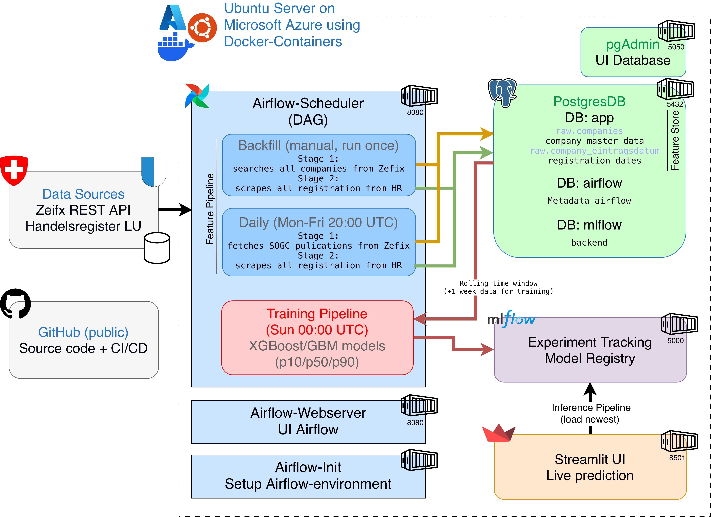

# Swiss Company Predictor

Predicts the number of new company registrations per calendar week in Canton Lucerne (CH), with 80% prediction intervals (p10 / p50 / p90).

Data source: [Zefix REST API](https://www.zefix.admin.ch/ZefixPublicREST/) + [Handelsregister Lucerne](https://lu.chregister.ch/).

[](https://github.com/AIMLstud/swiss-company-predictor/actions/workflows/ci.yml)

---

## Architecture (FTI Pipeline)



The project follows the **FTI (Feature / Training / Inference)** architecture — three decoupled pipelines:

**1. Feature Pipeline**
Airflow DAGs fetch raw data from the Zefix API and [Handelsregister Lucerne](https://lu.chregister.ch/) and store it in PostgreSQL (`raw.companies`, `raw.company_eintragsdatum`). The backfill runs once to seed all historical data; the daily sync keeps it up to date every weekday.

**2. Training Pipeline**
Every Sunday, Airflow reads from PostgreSQL, builds the feature matrix in memory (weekly registration counts, lag features, legal form shares), splits the data using a rolling time window, trains three XGBoost/GBM models (p10/p50/p90), and logs everything — parameters, metrics, and model artifacts — to MLflow.

**3. Inference Pipeline**
The Streamlit dashboard loads the latest model run from MLflow and serves predictions on demand. The user selects a target week and gets a point estimate (p50) with an 80% prediction interval (p10/p90).

The three pipelines are fully decoupled — the feature pipeline only writes to PostgreSQL, the training pipeline only reads from it, and the inference pipeline only reads from MLflow. Each can fail, restart, or be triggered independently without affecting the others.

---

```
Zefix REST API ──► feature_backfill (manual)
SOGC RSS feed  ──► feature_daily_sync (Mon–Fri) ──► PostgreSQL (raw.*)
                                                         │
                                        training_pipeline (@weekly)
                                                 │
                                           MLflow tracking
                                                 │
                                       Streamlit dashboard ──► predictions
```

| Component           | Technology                              |
|---------------------|-----------------------------------------|
| Orchestration       | Apache Airflow 2.x (TaskFlow API)       |
| Feature store / DB  | PostgreSQL 18 (`raw` schema)            |
| Experiment tracking | MLflow (self-hosted)                    |
| Models              | XGBoost (p50) + GBM quantile (p10/p90) |
| UI                  | Streamlit + Plotly                      |

### Feature engineering

Weekly aggregates are built from raw `eintragsdatum` rows:

| Feature       | Description                                      |
|---------------|--------------------------------------------------|
| `iso_week`    | Calendar week (1–53)                             |
| `lag_1`       | Registrations in the previous week               |
| `lag_4`       | Registrations 4 weeks ago (monthly seasonality)  |
| `lag_52`      | Registrations 52 weeks ago (annual seasonality)  |
| `ag_share`    | Share of AGs in the preceding week               |
| `gmbh_share`  | Share of GmbHs in the preceding week             |

### Models

Three models are trained in each weekly run and stored in MLflow:

| Model     | Algorithm                          | Purpose              |
|-----------|------------------------------------|----------------------|
| `model_p50` | XGBoost                          | Point estimate       |
| `model_p10` | GradientBoostingRegressor α=0.10 | Lower bound (10th %)  |
| `model_p90` | GradientBoostingRegressor α=0.90 | Upper bound (90th %)  |

---

## Prerequisites

- Docker ≥ 24 and Docker Compose V2
- [uv](https://docs.astral.sh/uv/) ≥ 0.5
- Access to the [Zefix REST API](https://www.zefix.admin.ch/ZefixPublicREST/) (requires registration at [zefix.admin.ch](https://www.zefix.admin.ch))

---

## Quick Start

```bash
git clone https://github.com/AIMLstud/swiss-company-predictor.git
cd swiss-company-predictor
cp .env.example .env
```

Open `.env` and fill in the required values — see `.env.example` for all variables and instructions (including how to generate `AIRFLOW__CORE__FERNET_KEY`).

```bash
docker compose up -d
```

| Service   | URL                    | Default login     |
|-----------|------------------------|-------------------|
| Airflow   | http://localhost:8080  | admin / admin     |
| MLflow    | http://localhost:5000  | —                 |
| pgAdmin   | http://localhost:5050  | admin@local.dev / admin |
| Streamlit | http://localhost:8501  | —                 |

> **macOS users:** AirPlay Receiver occupies port 5000 by default, which prevents MLflow from starting. Disable it under **System Settings → General → AirDrop & Handoff → AirPlay Receiver**.

---

## Live Deployment (Azure)

The full stack is deployed on an Ubuntu Server on Microsoft Azure using the same `docker compose up -d` setup. An [Nginx Proxy Manager](https://nginxproxymanager.com/) (NPM) sits in front of all services to handle HTTPS via Let's Encrypt certificates.

| Service   | URL                                          |
|-----------|----------------------------------------------|
| MLflow    | https://mlflow.swiss-company-predictor.ch    |
| pgAdmin   | https://pgadmin.swiss-company-predictor.ch   |
| Airflow   | https://airflow.swiss-company-predictor.ch   |
| Streamlit | https://ui.swiss-company-predictor.ch        |

Default login credentials are the same as in `.env.example`.

> **Note:** When configuring NPM, use the Docker **service name** (e.g. `pgadmin`, `mlflow`) as the forward hostname — not `localhost` — since NPM runs in its own container on the same `docker-net` network.

---

### Seeding historical data (dev only)

> **Not recommended for production.** The live backfill via the Zefix API and [Handelsregister Lucerne](https://lu.chregister.ch/) is the correct way to populate the database. The CSV seed below is intended for local development only to avoid waiting ~8h for the full scrape.

The seed CSV is not included in the repository and must be requested from the repo owner. Once obtained, place it in `tests/fixtures/` before triggering the DAG:

```bash
cp /path/to/260517_full_zefix_export_eintragsdatum.csv tests/fixtures/
```

The `feature_backfill` DAG detects this file and loads it directly instead of scraping live.

### First-time pipeline run

1. **Trigger `feature_backfill`** (manual, once) in the Airflow UI.
2. Wait for completion – Airflow will turn green.
3. `feature_daily_sync` runs automatically from that point on.
4. `training_pipeline` runs every Sunday midnight (@weekly); trigger it manually for the first model.
5. Open Streamlit at http://localhost:8501 to see predictions.

---

## Development

```bash
uv sync --all-extras          # install dev + all optional extras
uv run pytest -v              # run test suite
uv run ruff check src/        # lint
uv run mypy src/              # type-check
```

### Run training locally (without Docker)

```python
from training.train import run_training
run_training(
    val_start=(2024, 26),
    test_start=(2025, 1),
    tracking_uri="sqlite:///mlruns/mlflow.db",
)
```

### Run a prediction locally

```python
from inference.predict import predict_week
result = predict_week(2025, 20, tracking_uri="sqlite:///mlruns/mlflow.db")
print(result)  # {"p10": 12.3, "p50": 18.7, "p90": 24.1, "run_id": "..."}
```

---

## Repo Structure

```
src/
  common/        config, db, http retry, logging
  scraper/       zefix_client, sogc_client, hr_scraper, pipeline, uid_format
  features/      aggregation, feature_builder
  training/      split, baseline, train
  inference/     predict
dags/
  feature_backfill.py       manual, seeds raw data from Zefix + Handelsregister
  feature_daily_sync.py     Mon–Fri, incremental SOGC sync
  training_pipeline.py      @weekly (Sunday), trains + logs models to MLflow
streamlit_app/
  app.py                    Streamlit UI (predictions dashboard)
sql/init/                   PostgreSQL schema (raw schema only)
docker/                     Dockerfiles per service (airflow, mlflow, streamlit)
pgadmin/
  servers.json              pre-configured pgAdmin server connection
tests/                      unit tests with fixtures
references/                 Jupyter notebooks used during development only
```

---

## Environment Variables

| Variable                       | Required | Description                                |
|-------------------------------|----------|--------------------------------------------|
| `APP_DB_URL`                  | Yes      | SQLAlchemy URL for PostgreSQL              |
| `ZEFIX_USERNAME`              | Yes      | Zefix REST API credentials                 |
| `ZEFIX_PASSWORD`              | Yes      | Zefix REST API credentials                 |
| `MLFLOW_TRACKING_URI`         | No       | Defaults to `http://mlflow:5000`           |
| `SEED_CSV_PATH`               | No       | Path to seed CSV for instant backfill      |
| `AIRFLOW__CORE__FERNET_KEY`   | Yes      | Airflow encryption key                     |
